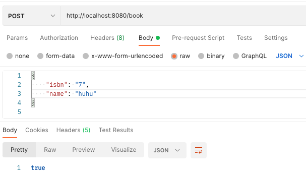
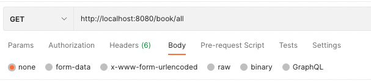

# Default Template MVN Java with tests
> This is a default template for neue fische projects of cgn-java-22-1

## Usage
Should be

and should give with 

```
[
    {
        "isbn": "7",
        "name": "huhu"
    }
]
```

as output.


## Contributing

If you'd like to contribute, please fork the repository and use a feature
branch. Pull requests are warmly welcome.
