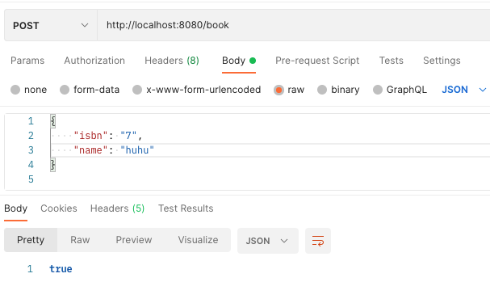
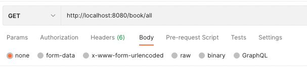

# Book repository
> Exercise neue fische book project of cgn-java-22-1
## Development
Tools used
1. [Intellij](https://www.jetbrains.com/de-de/idea/download/) 
2. [maven](https://maven.org),
3. Java17
4. [Postman](https://postman.com)
## Usage
E.g. clone this repository. Open it in IntelliJ. Start the server by 
running the ```DefaultWebProjectApplication```. 

In Postman

gives  

```
[
    {
        "isbn": "7",
        "name": "huhu"
    }
]
```

as output.


## Contributing

If you'd like to contribute, please fork the repository and use a feature
branch. Pull requests are warmly welcome.
